# Altschool Cloud Assignment1 by Valentine Madu
## Assignment update
Your login name: altschool i.e., home directory /home/altschool. The home directory contains the following sub-directories: code, tests, personal, misc Unless otherwise specified, you are running commands from the home directory.

a.Change directory to the tests directory using absolute pathname

b.Change directory to the tests directory using relative pathname

c.Use echo command to create a file named fileA with text content ‘Hello A’ in the misc directory

d.Create an empty file named fileB in the misc directory. Populate the file with a dummy content afterwards

e.Copy contents of fileA into fileC

f.Move contents of fileB into fileD

g.Create a tar archive called misc.tar for the contents of misc directory

h.Compress the tar archive to create a misc.tar.gz file

I. Create a user and force the user to change his/her password upon login

J. Lock a users password

K. Create a user with no login shell

L. Disable password based authentication for ssh

M. Disable root login for ssh

Mode of submission:

you are going to push the required commands to your github repositories.

Deadline: 12th Feb 2024

`make multiple directories`

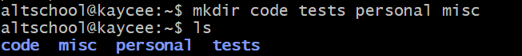

a. `change directory using absolute path name`

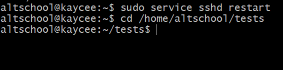

b. `change directory using relative path name`

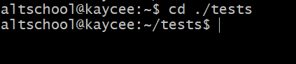

c. `use echo command to create a new file`

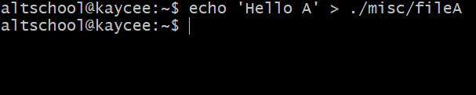

D-i-. `create empty file in misc directory`

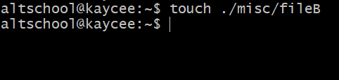

D-ii- `Populate file with dummy content`

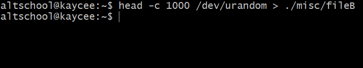

e. `copy contents of fileA into fileC`

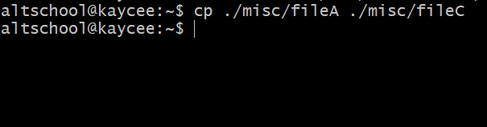

f. `move contents of fileB into fileD`

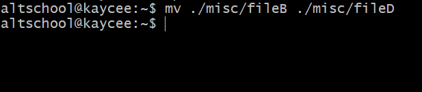

g. `create a tar archive, misc.tar for contents of misc directory`

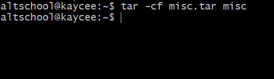

h. `compress the tar archive to create a misc.tar.gz file`

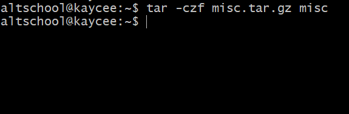

i. `create a user and force the user to change password`

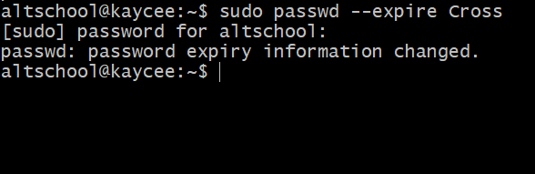

j. `lock a users password`

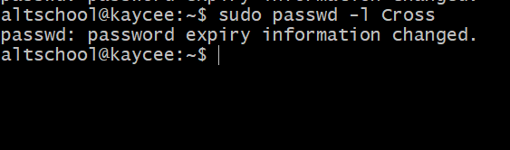

k. `create a user with no login shell`

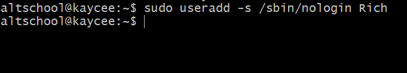

l. `disable password based authentication for ssh`

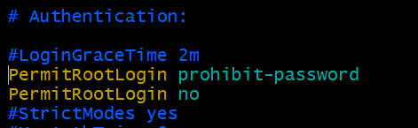

m. `disable root login for ssh`

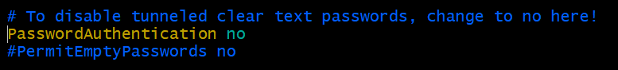

